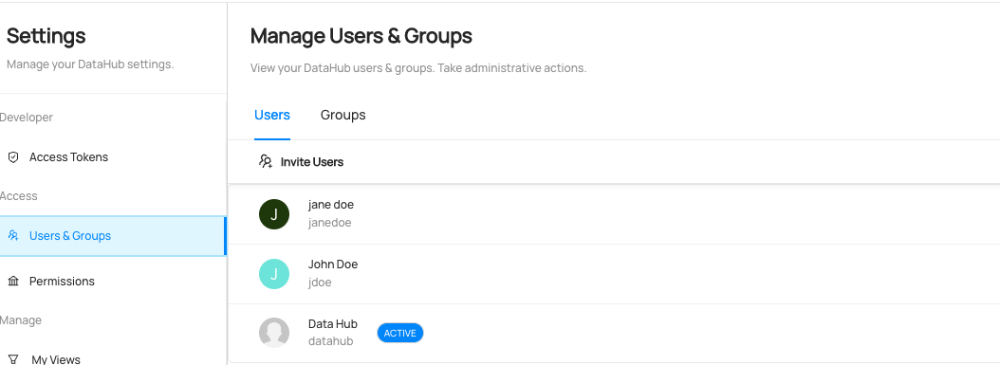
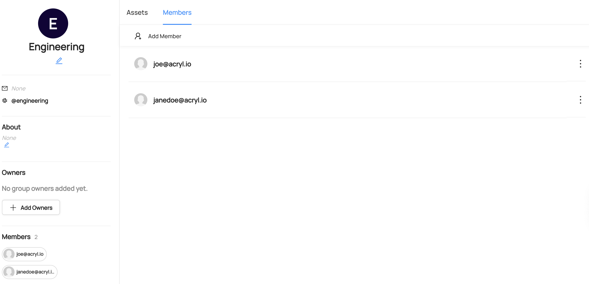

# Creating Users And Groups

## Why Would You Create Users and Groups?
Users and groups are essential for managing ownership of data. 
By creating user accounts and assigning them to appropriate groups, administrators can ensure that the right people can access the data they need to do their jobs. 
This helps to avoid confusion or conflicts over who is responsible for specific datasets and can improve the overall effectiveness. 

## Pre-requisites
For this tutorial, you need to deploy DataHub Quickstart and ingest sample data. 
For detailed information, please refer to [Preparing Your Local DataHub Environment](/docs/tools/tutorials/references/prepare-datahub.md).

:::note
In this guide, ingesting sample data is optional.
:::

## Create Users And Groups With Python CLI

You can ingest users and groups with `yaml` using Python CLI. 

### Create User

Save this `user.yaml` as a local file. 

```yaml
id: janedoe@acryl.io
slack: @janedoe
email: janedoe@acryl.io
first_name: Jane
last_name: Doe
```

Execute the following CLI command to ingest this user's information. 

```
datahub user create -c user.yaml
```

### Create Group

Save this `group.yaml` as a local file. Note that the group includes a list of users who are admins (these will be marked as owners) and members.
Within these lists, you can refer to the users by their ids or their urns, and can additionally specify their metadata inline within the group description itself. See the example below to understand how this works and feel free to make modifications to this file locally to see the effects of your changes in your local DataHub instance.

```yaml
id: engineering
display_name: Engineering
admins:
  - "janedoe@acryl.io"
members:
  - "jane@acryl.io" # refer to a user either by id or by urn
  - id: "joe@acryl.io" # inline specification of user
    slack: "@joe_shmoe"
    display_name: "Joe's Hub"
```

Execute the following CLI command to ingest this group's information. 

```
datahub group create -c group.yaml
```


## Create Users And Groups With Python SDK

### Create User

```python
import logging

from datahub.emitter.mce_builder import make_user_urn
from datahub.emitter.mcp import MetadataChangeProposalWrapper
from datahub.emitter.rest_emitter import DatahubRestEmitter

# Imports for metadata model classes
from datahub.metadata.schema_classes import CorpUserInfoClass

log = logging.getLogger(__name__)
logging.basicConfig(level=logging.INFO)

user_urn = make_user_urn("janedoe")
event: MetadataChangeProposalWrapper = MetadataChangeProposalWrapper(
    entityUrn=user_urn,
    aspect=CorpUserInfoClass(active=True,
                             displayName="Jane Doe",
                             email="janedoe@acryl.io",
                             title="Software Engineer",
                             firstName="Jane",
                             lastName="Doe",
                             fullName="Jane Doe"),
)

# Create rest emitter
rest_emitter = DatahubRestEmitter(gms_server="http://localhost:8080")
rest_emitter.emit(event)
log.info(f"Created user {user_urn}")
```

This will create a user named `Jane Doe` with urn `urn:li:corpuser:janedoe`.

### Create Group

```python
import logging

from datahub.emitter.mce_builder import make_group_urn, make_user_urn
from datahub.emitter.mcp import MetadataChangeProposalWrapper
from datahub.emitter.rest_emitter import DatahubRestEmitter

# Imports for metadata model classes
from datahub.metadata.schema_classes import CorpGroupInfoClass

log = logging.getLogger(__name__)
logging.basicConfig(level=logging.INFO)

group_urn = make_group_urn("engineering")
event: MetadataChangeProposalWrapper = MetadataChangeProposalWrapper(
    entityUrn=group_urn,
    aspect=CorpGroupInfoClass(admins=["urn:li:corpuser:janedoe"],
                              members=["urn:li:corpuser:janedoe", "urn:li:corpuser:joe"],
                              groups=[],
                              displayName="Engineering",
                              email="engineering@acryl.io",
                              description="Software engineering team",
                              slack="@engineering"),
)

# Create rest emitter
rest_emitter = DatahubRestEmitter(gms_server="http://localhost:8080")
rest_emitter.emit(event)
log.info(f"Created group {group_urn}")
```

This will create a group called `Engineering` with group `urn:li:corpgroup:engineering`.

We're using the `MetdataChangeProposalWrapper` to change entities in this example.
For more information about the `MetadataChangeProposal`, please refer to [MetadataChangeProposal & MetadataChangeLog Events](/docs/advanced/mcp-mcl.md)

## Expected Outcomes

### User
You can see user `Jane Doe` has beend created under `Settings > Access > Users & Groups`


### Group
You can see group `Engineering` has beend created under `Settings > Access > Users & Groups`

