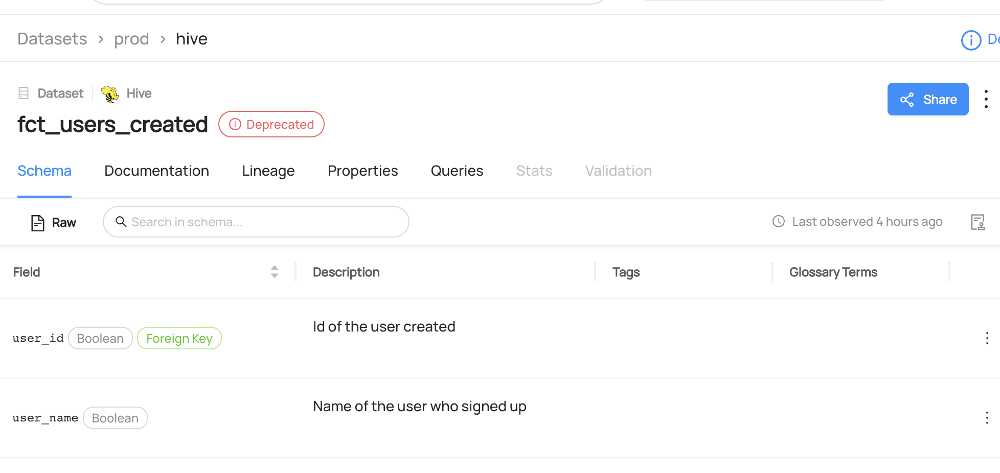

import Tabs from '@theme/Tabs';
import TabItem from '@theme/TabItem';

# ML System

## Why Would You Integrate ML System with DataHub?

The Deprecation feature on DataHub indicates the status of an entity. For datasets, keeping the deprecation status up-to-date is important to inform users and downstream systems of changes to the dataset's availability or reliability. By updating the status, you can communicate changes proactively, prevent issues and ensure users are always using highly trusted data assets.

### Goal Of This Guide

This guide will show you how to

- create ML entities: [MlFeature](/docs/generated/metamodel/entities/mlFeature.md), [MlFeatureTable](/docs/generated/metamodel/entities/mlFeatureTable.md), [MlModel](/docs/generated/metamodel/entities/mlModel.md), [MlModelGroup](/docs/generated/metamodel/entities/mlModelGroup.md)
- read ML entities
- attach MlFeatureTable or MlModel to MlFeature

## Prerequisites

For this tutorial, you need to deploy DataHub Quickstart and ingest sample data.
For detailed steps, please refer to [Datahub Quickstart Guide](/docs/quickstart.md).

:::note
Before updating deprecation, you need to ensure the targeted dataset is already present in your datahub.
If you attempt to manipulate entities that do not exist, your operation will fail.
In this guide, we will be using data from a sample ingestion.
:::

## Create ML Entities

### Create MlFeature

<Tabs>
<TabItem value="python" label="Python" default>

```python
{{ inline /metadata-ingestion/examples/library/create_mlfeature.py show_path_as_comment }}
```

</TabItem>
</Tabs>

### Create MlFeatureTable

<Tabs>
<TabItem value="python" label="Python" default>

```python
{{ inline /metadata-ingestion/examples/library/create_mlfeature_table.py show_path_as_comment }}
```

</TabItem>
</Tabs>

### Create MlModel

<Tabs>
<TabItem value="python" label="Python" default>

```python
{{ inline /metadata-ingestion/examples/library/create_mlmodel.py show_path_as_comment }}
```

</TabItem>
</Tabs>

### Create MlModelGroup

<Tabs>
<TabItem value="python" label="Python" default>

```python
{{ inline /metadata-ingestion/examples/library/create_mlmodel_group.py show_path_as_comment }}
```

</TabItem>
</Tabs>

## Read ML Entities

### Read MLFeature

<Tabs>
<TabItem value="graphql" label="GraphQL" default>

```json
{
  mlFeature(urn: "urn:li:mlFeature:(test_feature_table_all_feature_dtypes,test_BOOL_LIST_feature)"){
    name
    featureNamespace
    description
    properties {
      description
      dataType
      version {
        versionTag
      }
    }
  }
}
```

</TabItem>
<TabItem value="curl" label="Curl" default>

</TabItem>
<TabItem value="python" label="Python">

```python
{{ inline /metadata-ingestion/examples/library/read_mlfeature.py show_path_as_comment }}
```

</TabItem>
</Tabs>

### Read MLFeatureTable

<Tabs>
<TabItem value="graphql" label="GraphQL" default>

```json
{
  mlFeatureTable(urn: "urn:li:mlFeatureTable:(urn:li:dataPlatform:feast,test_feature_table_all_feature_dtypes)"){
    name
    description
    platform {
      name
    }
    properties {
      description
      mlFeatures {
        name
      }
    }
  }
}
```

</TabItem>
<TabItem value="curl" label="Curl">

</TabItem>
<TabItem value="python" label="Python">

```python
{{ inline /metadata-ingestion/examples/library/read_mlfeature_table.py show_path_as_comment }}
```

</TabItem>
</Tabs>

### Read MLModel

<Tabs>
<TabItem value="graphql" label="GraphQL" default>

```json
{
  mlModel(urn: "urn:li:mlModel:(urn:li:dataPlatform:science,scienceModel,PROD)"){
    name
    description
    properties {
      description
      version
      type
      mlFeatures
      groups {
        urn
        name
      }
    }
  }
}
```

</TabItem>
<TabItem value="curl" label="Curl" default>

</TabItem>
<TabItem value="python" label="Python">

```python
{{ inline /metadata-ingestion/examples/library/read_mlmodel.py show_path_as_comment }}
```

</TabItem>
</Tabs>

### Read MLModelGroup

<Tabs>
<TabItem value="graphql" label="GraphQL" default>

```json
{
  mlModelGroup(urn: "urn:li:mlFeatureTable:(urn:li:dataPlatform:feast,test_feature_table_all_feature_dtypes)"){
    name
    description
    platform {
      name
    }
    properties {
      description
    }
  }
}
```

</TabItem>
<TabItem value="curl" label="Curl">

</TabItem>
<TabItem value="python" label="Python">

```python
{{ inline /metadata-ingestion/examples/library/read_mlmodel_group.py show_path_as_comment }}
```

</TabItem>
</Tabs>

## Attach ML Entities

### Attach MlFeatureTable to MlFeature

<Tabs>
<TabItem value="python" label="Python">

```python
{{ inline /metadata-ingestion/examples/library/attach_mlfeature_table_to_mlfeature.py show_path_as_comment }}
```

</TabItem>
</Tabs>

### Attach MlModel to MlFeature

<Tabs>
<TabItem value="python" label="Python">

```python
{{ inline /metadata-ingestion/examples/library/attach_mlmodel_to_mlfeature.py show_path_as_comment }}
```

</TabItem>
</Tabs>

### Expected Outcomes of Attaching ML Entities

You can now see the dataset `fct_users_created` has been marked as `Deprecated.`


