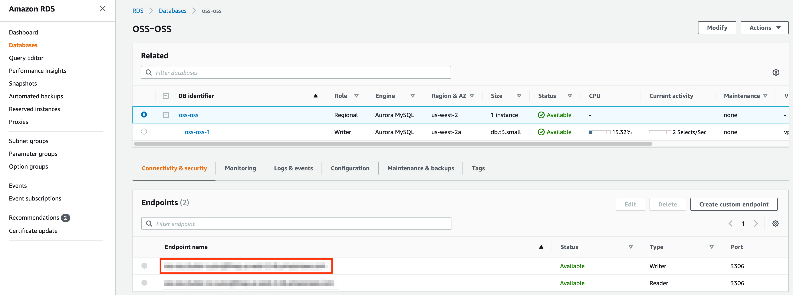
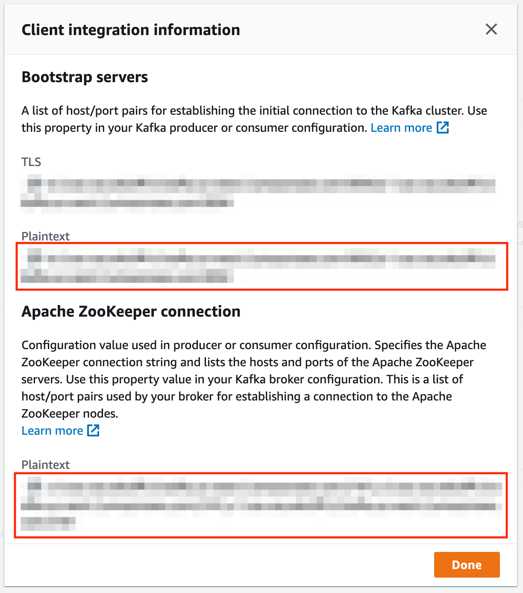

# GCP setup guide

The following is a set of instructions to quickstart DataHub on GCP Google Kubernetes Engine (GKE). Note, the guide
assumes that you do not have a kubernetes cluster set up. If you are deploying DataHub to an existing cluster, please
skip the corresponding sections.

## Prerequisites

This guide requires the following tools:

- [kubectl](https://kubernetes.io/docs/tasks/tools/) to manage kubernetes resources
- [helm](https://helm.sh/docs/intro/install/) to deploy the resources based on helm charts. Note, we only support Helm
    3.
- [gcloud](https://cloud.google.com/sdk/docs/install) to manage GCP resources

Follow the following gu

## Start up a kubernetes cluster on AWS EKS

Let’s follow this [guide](https://docs.aws.amazon.com/eks/latest/userguide/getting-started-eksctl.html) to create a new
cluster using eksctl. Run the following command with cluster-name set to the cluster name of choice, and region set to
the AWS region you are operating on.

```
eksctl create cluster \
    --name <<cluster-name>> \
    --region <<region>> \
    --with-oidc \
    --nodes=3
```

The command will provision an EKS cluster powered by 3 EC2 m3.large nodes and provision a VPC based networking layer.

If you are planning to run the storage layer (MySQL, Elasticsearch, Kafka) as pods in the cluster, you need at least 3
nodes. If you decide to use managed storage services, you can reduce the number of nodes or use m3.medium nodes to save
cost. Refer to this [guide](https://eksctl.io/usage/creating-and-managing-clusters/) to further customize the cluster
before provisioning.

Note, OIDC setup is required for following this guide when setting up the load balancer.

Run `kubectl get nodes` to confirm that the cluster has been setup correctly. You should get results like below

```
NAME                                          STATUS   ROLES    AGE   VERSION
ip-192-168-49-49.us-west-2.compute.internal   Ready    <none>   3h    v1.18.9-eks-d1db3c
ip-192-168-64-56.us-west-2.compute.internal   Ready    <none>   3h    v1.18.9-eks-d1db3c
ip-192-168-8-126.us-west-2.compute.internal   Ready    <none>   3h    v1.18.9-eks-d1db3c
```

## Setup DataHub using Helm

Once the kubernetes cluster has been set up, you can deploy DataHub and it’s prerequisites using helm. Please follow the
steps in this [guide](../../datahub-kubernetes/README.md)

## Expose endpoints using a load balancer

Now that all the pods are up and running, you need to expose the datahub-frontend end point by setting
up [ingress](https://kubernetes.io/docs/concepts/services-networking/ingress/). To do this, you need to first set up an
ingress controller. There are
many [ingress controllers](https://kubernetes.io/docs/concepts/services-networking/ingress-controllers/)  to choose
from, but here, we will follow
this [guide](https://docs.aws.amazon.com/eks/latest/userguide/aws-load-balancer-controller.html) to set up the AWS
Application Load Balancer(ALB) Controller.

First, if you did not use eksctl to setup the kubernetes cluster, make sure to go through the prerequisites listed
[here](https://docs.aws.amazon.com/eks/latest/userguide/alb-ingress.html).

Download the IAM policy document for allowing the controller to make calls to AWS APIs on your behalf.

```
curl -o iam_policy.json https://raw.githubusercontent.com/kubernetes-sigs/aws-load-balancer-controller/v2.2.0/docs/install/iam_policy.json
```

Create an IAM policy based on the policy document by running the following.

```
aws iam create-policy \
    --policy-name AWSLoadBalancerControllerIAMPolicy \
    --policy-document file://iam_policy.json
```

Use eksctl to create a service account that allows us to attach the above policy to kubernetes pods.

```
eksctl create iamserviceaccount \
  --cluster=<<cluster-name>> \
  --namespace=kube-system \
  --name=aws-load-balancer-controller \
  --attach-policy-arn=arn:aws:iam::<<account-id>>:policy/AWSLoadBalancerControllerIAMPolicy \
  --override-existing-serviceaccounts \
  --approve      
```

Install the TargetGroupBinding custom resource definition by running the following.

```
kubectl apply -k "github.com/aws/eks-charts/stable/aws-load-balancer-controller//crds?ref=master"
```

Add the helm chart repository containing the latest version of the ALB controller.

```
helm repo add eks https://aws.github.io/eks-charts
helm repo update
```

Install the controller into the kubernetes cluster by running the following.

```
helm upgrade -i aws-load-balancer-controller eks/aws-load-balancer-controller \
  --set clusterName=<<cluster-name>> \
  --set serviceAccount.create=false \
  --set serviceAccount.name=aws-load-balancer-controller \
  -n kube-system
```

Verify the install completed by running `kubectl get deployment -n kube-system aws-load-balancer-controller`. It should
return a result like the following.

```
NAME                           READY   UP-TO-DATE   AVAILABLE   AGE
aws-load-balancer-controller   2/2     2            2           142m
```

Now that the controller has been set up, we can enable ingress by updating the quickstart-values.yaml (or any other
values.yaml file used to deploy datahub). Change datahub-frontend values to the following.

```
datahub-frontend:
  enabled: true
  image:
    repository: linkedin/datahub-frontend-react
    tag: "latest"
  ingress:
    enabled: true
    annotations:
      kubernetes.io/ingress.class: alb
      alb.ingress.kubernetes.io/scheme: internet-facing
      alb.ingress.kubernetes.io/target-type: instance
      alb.ingress.kubernetes.io/certificate-arn: <<certificate-arn>>
      alb.ingress.kubernetes.io/inbound-cidrs: 0.0.0.0/0
      alb.ingress.kubernetes.io/listen-ports: '[{"HTTP": 80}, {"HTTPS":443}]'
      alb.ingress.kubernetes.io/actions.ssl-redirect: '{"Type": "redirect", "RedirectConfig": { "Protocol": "HTTPS", "Port": "443", "StatusCode": "HTTP_301"}}'
    hosts:
      - host: <<host-name>>
        redirectPaths:
          - path: /*
            name: ssl-redirect
            port: use-annotation
        paths:
          - /*
```

You need to request a certificate in the AWS Certificate Manager by following this
[guide](https://docs.aws.amazon.com/acm/latest/userguide/gs-acm-request-public.html), and replace certificate-arn with
the ARN of the new certificate. You also need to replace host-name with the hostname of choice like
demo.datahubproject.io.

After updating the yaml file, run the following to apply the updates.

```
helm install datahub datahub/ --values datahub/quickstart-values.yaml
```

Once the upgrade completes, run `kubectl get ingress` to verify the ingress setup. You should see a result like the
following.

```
NAME                       CLASS    HOSTS                         ADDRESS                                                                 PORTS   AGE
datahub-datahub-frontend   <none>   demo.datahubproject.io   k8s-default-datahubd-80b034d83e-904097062.us-west-2.elb.amazonaws.com   80      3h5m
```

Note down the elb address in the address column. Add the DNS CNAME record to the host domain pointing the host-name (
from above) to the elb address. DNS updates generally take a few minutes to an hour. Once that is done, you should be
able to access datahub-frontend through the host-name.

## Use AWS managed services for the storage layer

Managing the storage services like MySQL, Elasticsearch, and Kafka as kubernetes pods requires a great deal of
maintenance workload. To reduce the workload, you can use managed services like AWS [RDS](https://aws.amazon.com/rds),
[Elasticsearch Service](https://aws.amazon.com/elasticsearch-service/), and [Managed Kafka](https://aws.amazon.com/msk/)
as the storage layer for DataHub. Support for using AWS Neptune as graph DB is coming soon.

### RDS

Provision a MySQL database in AWS RDS that shares the VPC with the kubernetes cluster or has VPC peering set up between
the VPC of the kubernetes cluster. Once the database is provisioned, you should be able to see the following page. Take
a note of the endpoint marked by the red box.



First, add the DB password to kubernetes by running the following.

```
kubectl delete secret mysql-secrets
kubectl create secret generic mysql-secrets --from-literal=mysql-root-password=<<password>>
```

Update the sql settings under global in the quickstart-values.yaml as follows.

```
  sql:
    datasource:
      host: "<<rds-endpoint>>:3306"
      hostForMysqlClient: "<<rds-endpoint>>"
      port: "3306"
      url: "jdbc:mysql://<<rds-endpoint>>:3306/datahub?verifyServerCertificate=false&useSSL=true&useUnicode=yes&characterEncoding=UTF-8"
      driver: "com.mysql.jdbc.Driver"
      username: "root"
      password:
        secretRef: mysql-secrets
        secretKey: mysql-root-password
```

Run `helm install datahub datahub/ --values datahub/quickstart-values.yaml` to apply the changes.

### Elasticsearch Service

Provision an elasticsearch domain running elasticsearch version 7.9 or above that shares the VPC with the kubernetes
cluster or has VPC peering set up between the VPC of the kubernetes cluster. Once the domain is provisioned, you should
be able to see the following page. Take a note of the endpoint marked by the red box.


Update the elasticsearch settings under global in the quickstart-values.yaml as follows.

```
  elasticsearch:
    host: <<elasticsearch-endpoint>>
    port: "443"
    indexPrefix: demo
    useSSL: "true"
```

You can also allow communication via HTTP (without SSL) by using the settings below.

```
  elasticsearch:
    host: <<elasticsearch-endpoint>>
    port: "80"
    indexPrefix: demo
```

Run `helm install datahub datahub/ --values datahub/quickstart-values.yaml` to apply the changes.

### Managed Streaming for Apache Kafka (MSK)

Provision an MSK cluster that shares the VPC with the kubernetes cluster or has VPC peering set up between the VPC of
the kubernetes cluster. Once the domain is provisioned, click on the “View client information” button in the ‘Cluster
Summary” section. You should see a page like below. Take a note of the endpoints marked by the red boxes.



Update the kafka settings under global in the quickstart-values.yaml as follows.

```
kafka:
    bootstrap:
      server: "<<bootstrap-server endpoint>>"
    zookeeper:
      server:  "<<zookeeper endpoint>>"
    schemaregistry:
      url: "http://prerequisites-cp-schema-registry:8081"
```

Run `helm install datahub datahub/ --values datahub/quickstart-values.yaml` to apply the changes. 
