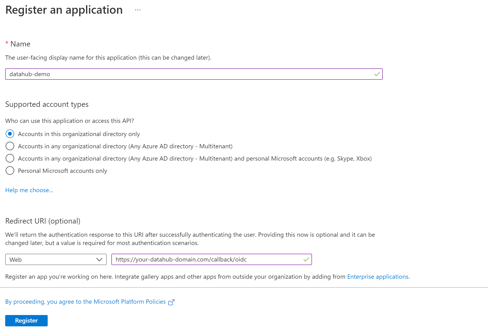
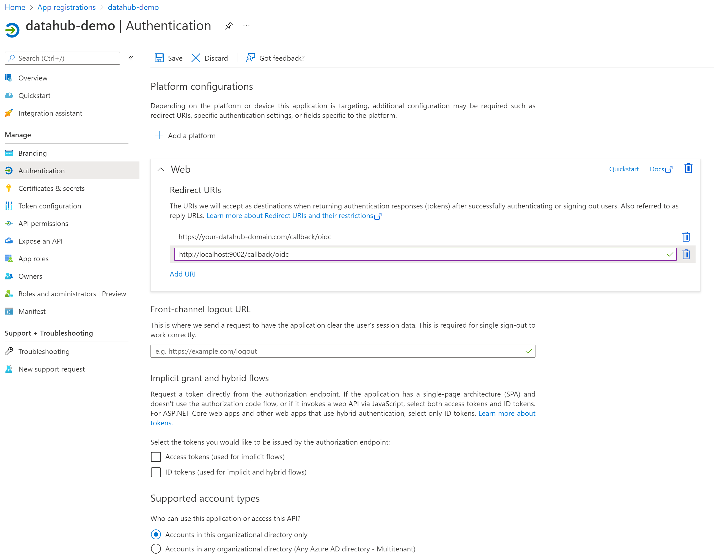
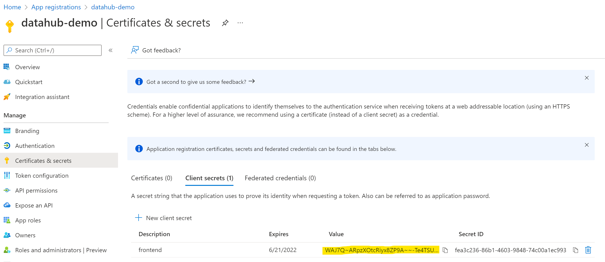

# Configuración de azure Authentication for React App (OIDC)

*Escrito el 21/12/2021*

`datahub-frontend` El servidor se puede configurar para autenticar usuarios a través de OpenID Connect (OIDC). Como tal, se puede configurar para
delegar la responsabilidad de la autenticación a proveedores de identidad como Microsoft Azure.

Esta guía proporcionará los pasos para configurar la autenticación de DataHub mediante Microsoft Azure.

## Pasos

### 1. Crear un registro de aplicación en el portal de Microsoft Azure

un. Con una cuenta vinculada a su organización, vaya al [Microsoft Azure Portal](https://portal.azure.com).

b. Escoger **Registros de aplicaciones**entonces **Nuevo registro** para registrar una nueva aplicación.

c. Asigne un nombre al registro de la aplicación y elija quién puede acceder a su aplicación.

d. Seleccione `Web` como el **URI de redireccionamiento** escriba e introduzca lo siguiente:

    https://your-datahub-domain.com/callback/oidc

Si solo está probando localmente, se puede usar lo siguiente: `http://localhost:9002/callback/oidc`.
Azure admite más de un URI de redireccionamiento, por lo que ambos se pueden configurar al mismo tiempo desde el **Autenticación** una vez completado el registro.

En este punto, el registro de la aplicación debería tener el siguiente aspecto:

e. Clic **Registro**.

### 2. Configurar la autenticación (opcional)

Una vez que se realiza el registro, aterrizará en el registro de la aplicación **Visión general** pestaña.  En la barra de navegación del lado izquierdo, haga clic en **Autenticación** debajo **Gestionar** y agregue URI de redireccionamiento adicionales si es necesario (si desea admitir tanto las pruebas locales como las implementaciones de Azure).

Clic **Salvar**.

### 3. Configurar certificados y secretos

En la barra de navegación del lado izquierdo, haga clic en **Certificados y secretos** debajo **Gestionar**.\
Escoger **Secretos del cliente**entonces **Nuevo secreto de cliente**.  Escriba una descripción significativa para su secreto y seleccione una caducidad.  Haga clic en el botón **Agregar** cuando haya terminado.

**IMPORTANTE:** Copie el `value` de su secreto recién creado, ya que Azure nunca mostrará su valor después.

### 4. Configurar permisos de API

En la barra de navegación del lado izquierdo, haga clic en **Permisos de API** debajo **Gestionar**.  DataHub requiere las cuatro API de Microsoft Graph siguientes:

1.  `User.Read` *(debe estar ya configurado)*
2.  `profile`
3.  `email`
4.  `openid`

Haga clic en **Agregar un permiso**, luego desde el **API de Microsoft** seleccionar ficha **Gráfico de Microsoft**entonces **Permisos delegados**.  Del **Permisos de OpenId** categoría, seleccione `email`, `openid`, `profile` y haga clic en **Agregar permisos**.

En este punto, deberías estar mirando una pantalla como la siguiente:

### 5. Obtener id de aplicación (cliente)

En la barra de navegación del lado izquierdo, vuelve a la casilla **Visión general** pestaña.  Debería ver el `Application (client) ID`. Guarde su valor para el siguiente paso.

### 6. Obtener URI de descubrimiento

En la misma página, debería ver un `Directory (tenant) ID`. El URI de detección de OIDC tendrá el siguiente formato:

    https://login.microsoftonline.com/{tenant ID}/v2.0/.well-known/openid-configuration

### 7. Configurar `datahub-frontend` Para habilitar la autenticación OIDC

un. Abrir el archivo `docker/datahub-frontend/env/docker.env`

b. Agregue los siguientes valores de configuración al archivo:

    AUTH_OIDC_ENABLED=true
    AUTH_OIDC_CLIENT_ID=your-client-id
    AUTH_OIDC_CLIENT_SECRET=your-client-secret
    AUTH_OIDC_DISCOVERY_URI=https://login.microsoftonline.com/{tenant ID}/v2.0/.well-known/openid-configuration
    AUTH_OIDC_BASE_URL=your-datahub-url
    AUTH_OIDC_SCOPE="openid profile email"

Reemplazar los marcadores de posición anteriores con el identificador de cliente (paso 5), el secreto de cliente (paso 3) y el identificador de inquilino (paso 6) recibidos de Microsoft Azure.

### 9. Reiniciar `datahub-frontend-react` contenedor docker

Ahora, simplemente reinicie el `datahub-frontend-react` contenedor para habilitar la integración.

    docker-compose -p datahub -f docker-compose.yml -f docker-compose.override.yml  up datahub-frontend-react

Desplácese hasta su dominio de DataHub para ver el inicio de sesión único en acción.

## Recursos

*   [Plataforma de identidad de Microsoft y protocolo OpenID Connect](https://docs.microsoft.com/en-us/azure/active-directory/develop/v2-protocols-oidc/)
