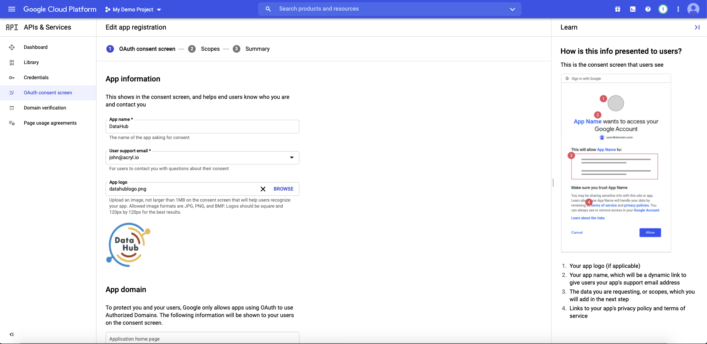
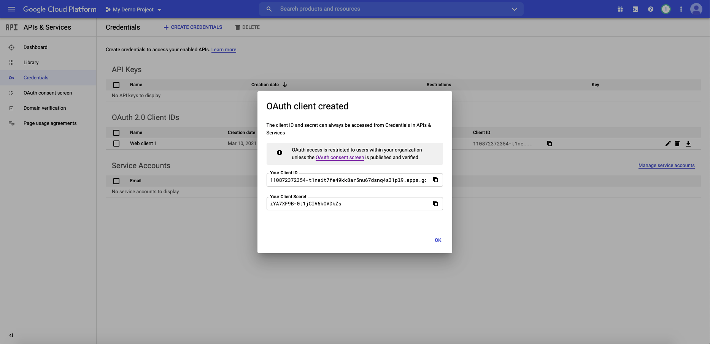

# Configuración de la autenticación de Google para la aplicación React (OIDC)

*Escrito el 3/10/2021*

`datahub-frontend` El servidor se puede configurar para autenticar usuarios a través de OpenID Connect (OIDC). Como tal, se puede configurar para delegar
responsabilidad de autenticación ante proveedores de identidad como Google.

Esta guía proporcionará los pasos para configurar la autenticación de DataHub mediante Google.

## Pasos

### 1. Crear un proyecto en Google API Console

Con una cuenta vinculada a su organización, vaya al [Consola de API de Google](https://console.developers.google.com/) y selecciona **Nuevo proyecto**.
Dentro de este proyecto, configuraremos la pantalla y las credenciales de OAuth2.0.

### 2. Crear la pantalla de consentimiento de OAuth2.0

un. Desplácese a `OAuth consent screen`. Aquí es donde configurará la pantalla que ven sus usuarios al intentar
inicie sesión en DataHub.

b. Escoger `Internal` (si solo desea que los usuarios de su empresa tengan acceso) y, a continuación, haga clic en **Crear**.
Tenga en cuenta que para completar este paso debe iniciar sesión en una cuenta de Google asociada con su organización.

c. Complete los detalles en las secciones Información de la aplicación y Dominio. Asegúrese de que la 'Página de inicio de la aplicación' proporcionada coincida con el lugar donde se implementa DataHub
en su organización.

Una vez que haya completado esto, **Guardar y continuar**.

d. Configurar los ámbitos: A continuación, haga clic en **Agregar o quitar ámbitos**. Seleccione los siguientes ámbitos:

    - `.../auth/userinfo.email`
    - `.../auth/userinfo.profile`
    - `openid`

Una vez que los haya seleccionado, **Guardar y continuar**.

### 3. Configurar las credenciales del cliente

Ahora navegue hasta el **Credenciales** pestaña. Aquí es donde obtendrá su id de cliente y secreto, así como configurar la información
como el URI de redireccionamiento utilizado después de autenticar a un usuario.

un. Clic **Crear credenciales** y seleccione `OAuth client ID` como el tipo de credencial.

b. En la siguiente pantalla, seleccione `Web application` como su tipo de aplicación.

c. Agregue el dominio donde está alojado DataHub a sus 'Orígenes autorizados de Javascript'.

    https://your-datahub-domain.com

d. Agregue el dominio donde se aloja DataHub con la ruta `/callback/oidc` anexado a 'URL de redireccionamiento autorizadas'.

    https://your-datahub-domain.com/callback/oidc

e. Clic **Crear**

f. Ahora recibirá un par de valores, un identificador de cliente y un secreto de cliente. Marque estos para el siguiente paso.

En este punto, deberías estar mirando una pantalla como la siguiente:

¡Éxito!

### 4. Configurar `datahub-frontend` Para habilitar la autenticación OIDC

un. Abrir el archivo `docker/datahub-frontend/env/docker.env`

b. Agregue los siguientes valores de configuración al archivo:

    AUTH_OIDC_ENABLED=true
    AUTH_OIDC_CLIENT_ID=your-client-id
    AUTH_OIDC_CLIENT_SECRET=your-client-secret
    AUTH_OIDC_DISCOVERY_URI=https://accounts.google.com/.well-known/openid-configuration
    AUTH_OIDC_BASE_URL=your-datahub-url
    AUTH_OIDC_SCOPE="openid profile email"
    AUTH_OIDC_USER_NAME_CLAIM=email
    AUTH_OIDC_USER_NAME_CLAIM_REGEX=([^@]+)

Reemplazar los marcadores de posición anteriores con el id de cliente y el secreto de cliente recibidos de Google en el Paso 3f.

### 5. Reiniciar `datahub-frontend-react` contenedor docker

Ahora, simplemente reinicie el `datahub-frontend-react` contenedor para habilitar la integración.

    docker-compose -p datahub -f docker-compose.yml -f docker-compose.override.yml  up datahub-frontend-react

Desplácese hasta su dominio de DataHub para ver el inicio de sesión único en acción.

## Referencias

*   [OpenID Connect en Google Identity](https://developers.google.com/identity/protocols/oauth2/openid-connect)
