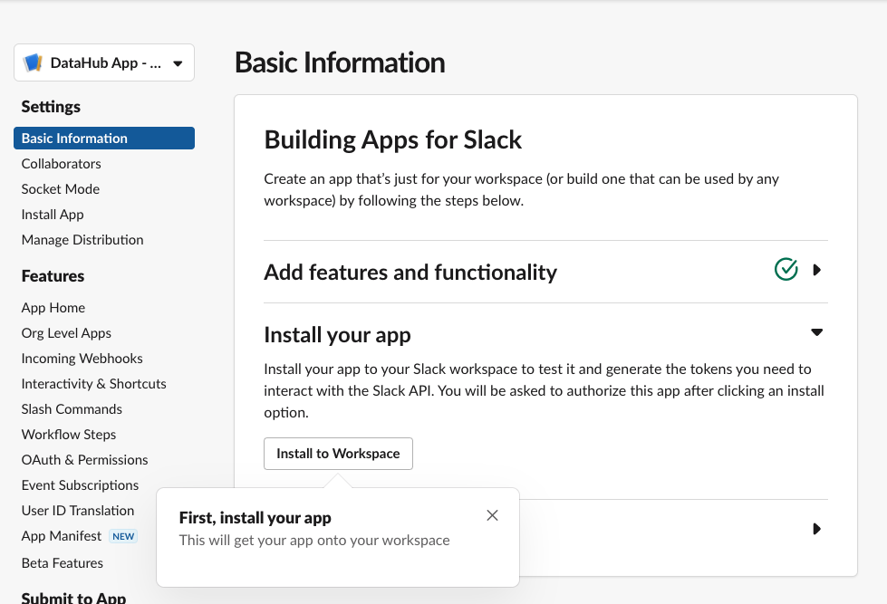
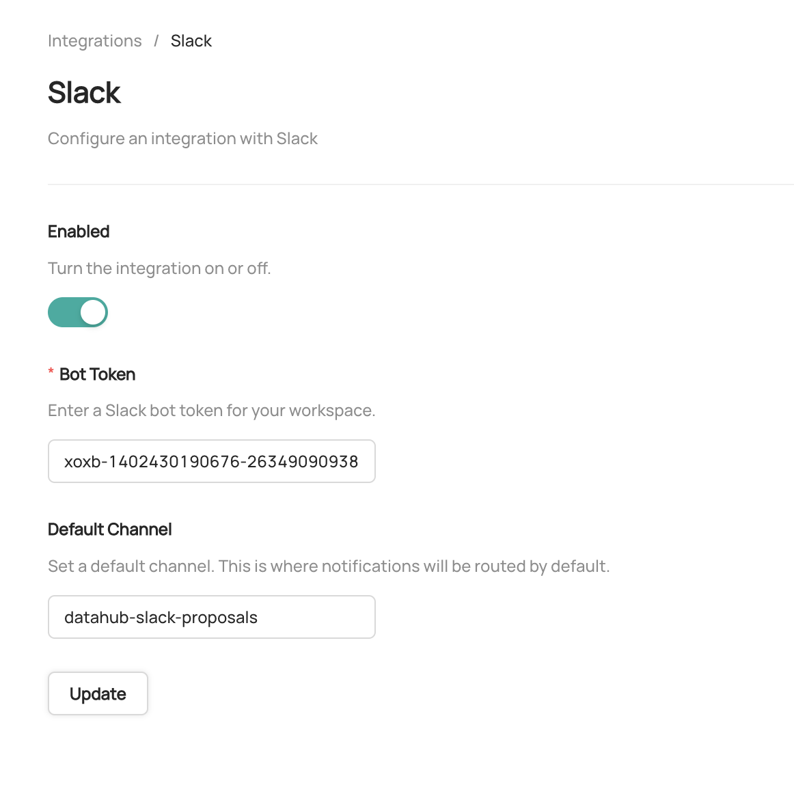
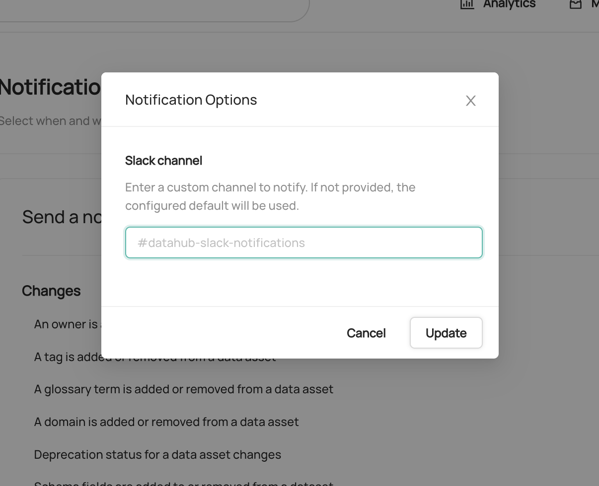

# Slack Integration

### Steps for installing DataHub Slack App

The steps for configuring include Slack integration include&#x20;

1. Install the DataHub Slack App into your Slack workspace
2. Configure Acryl DataHub's integration with Slack

In the next sections, we'll provide a detailed walkthrough of each step.

### Installing DataHub Slack App&#x20;

The following steps should be performed by a Slack Workspace Admin.&#x20;

* Navigate to  [https://api.slack.com/apps/](https://api.slack.com/apps/)
* Click **Create New App**
* Use “From an app manifest” option
* Select your workspace
*   Paste this Manifest in YAML. Suggest changing `name` and `display_name` to be `DataHub App YOUR_TEAM_NAME` but not required. This name will show up in your slack workspace

    ```bash
    display_information:
      name: DataHub App
      description: An app to integrate DataHub with Slack
      background_color: "#000000"
    features:
      bot_user:
        display_name: DataHub App
        always_online: false
    oauth_config:
      scopes:
        bot:
          - channels:read
          - chat:write
          - commands
          - groups:read
          - im:read
          - mpim:read
          - team:read
          - users:read
          - users:read.email
    settings:
      org_deploy_enabled: false
      socket_mode_enabled: false
      token_rotation_enabled: false
    ```

Confirm you see the Basic Information Tab



* Click **Install to Workspace**
* It will show you permissions the Slack App is asking for, what they mean and a default channel in which you want to add the slack app
  * Note that the Slack App will only be able to post in channels that the app has been added to. This is made clear by slack’s Authentication screen also.
* Select the channel you'd like notifications to go to and click **Allow**
* Go to DataHub App page
  * You can find your workspace's list of apps at [https://api.slack.com/apps/](https://api.slack.com/apps/)

### Generating a Bot Token

* Go to “**OAuth & Permissions” Tab**

.png)

Here you'll find a “**Bot User OAuth Token**” which DataHub will need to communicate with your slack through the bot.&#x20;

In the next steps, we'll show you how to configure the Slack Integration inside of Acryl DataHub.


### Configuring Notifications&#x20;

> In order to set up the Slack integration, the user must have the `Manage Platform Settings` privilege.&#x20;

#### Enabling the Slack Integration&#x20;

To enable the integration with slack, start by navigating to **Settings > Integrations.**

1. Click **Slack**
2. Enable the Integration&#x20;
3. Enter the **Bot Token** obtained in the previous steps
4. Enter a **Default Slack Channel** - this is where all notifications will be routed unless&#x20;
5. Click **Update** to save your settings



#### Configuring Notification Types

To enable and disable specific types of notifications, or configure custom routing for notifications,  start by navigating to **Settings > Notifications**. &#x20;

To enable or disable a specific notification type in Slack, simply click the check mark. By default, all notification types are enabled.

To customize the channel where notifications are send, click the button to the right of the check box.



If provided, a custom channel will be used to route notifications of the given type. If not provided, the default channel will be used.&#x20;

That's it! You should begin to receive notifications on Slack. Note that it may take up to 1 minute for notification settings to take effect after saving.&#x20;

### Sending Notifications

For now we support sending notifications to

* Slack Channel ID (e.g. `C029A3M079U`)
* Slack Channel Name (e.g. `#troubleshoot`)
* Specific Users (aka Direct Messages or DMs) via user ID&#x20;

### How to find Team ID and Channel ID in Slack

* Go to the Slack channel for which you want to get channel ID
*   Check the URL e.g. for the [troubleshoot channel in OSS DataHub slack](https://app.slack.com/client/TUMKD5EGJ/C029A3M079U)

     (1).png)
* Notice `TUMKD5EGJ/C029A3M079U` in the URL
  * Team ID = `TUMKD5EGJ` from above
  * Channel ID = `C029A3M079U` from above

### How to find User ID in Slack

* Go to user DM
* Click on their profile picture
* Click on View Full Profile
* Click on “More”
* Click on “Copy member ID”

.png)
