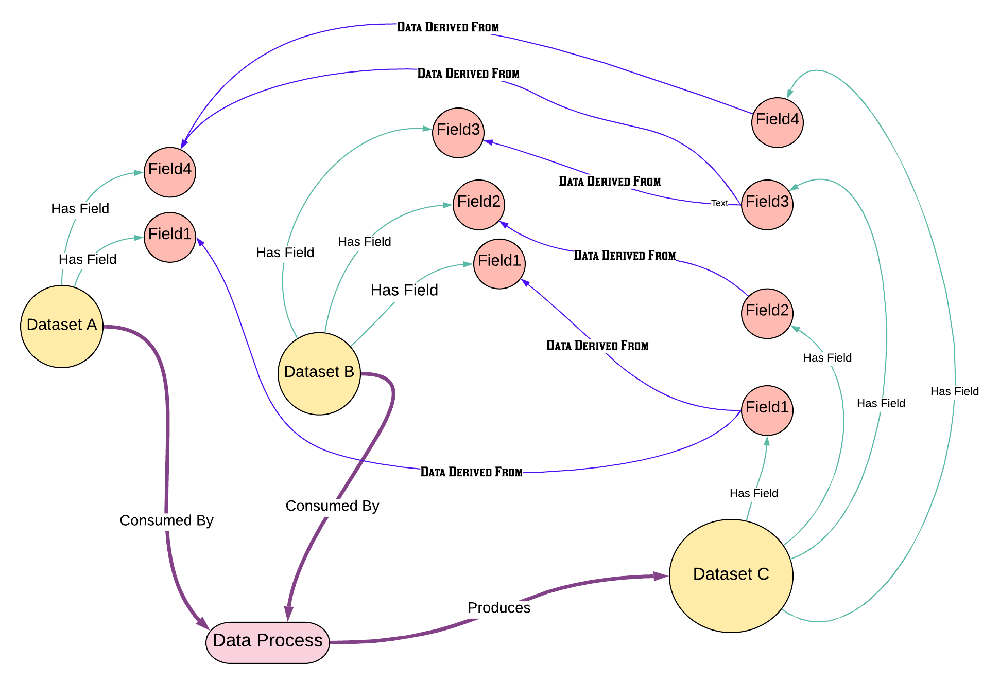
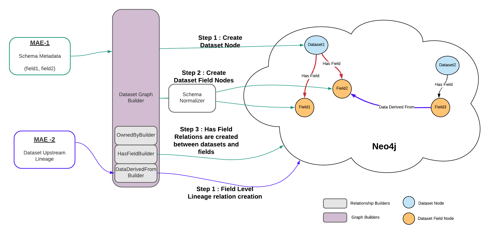
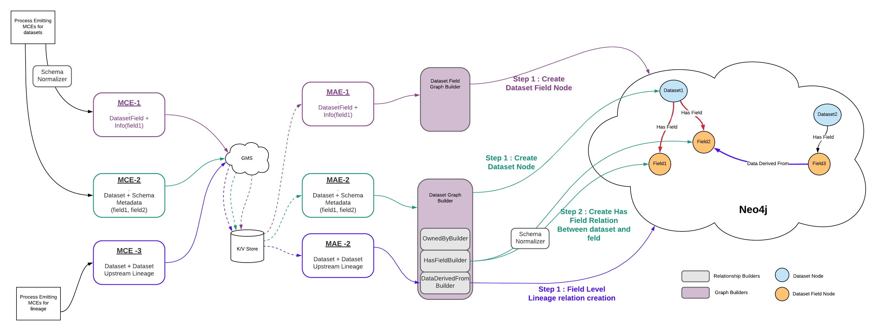

- Start Date: 2020-08-28
- RFC PR: #1841
- Discussion Issue: #1731
- Implementation PR(s):

# RFC - Field Level Lineage

## Summary

DataHub supports dataset level lineage. UpStreamLineage is an aspect of dataset that powers the dataset level lineage (a.k.a., coarse-grained lineage). 
However, there is a need to understand the lineage at the field level (a.k.a., fine-grained lineage) 

In this RFC, we will discuss below and get consensus on the modelling involved.
- Representation of a field in a dataset
- Representation of the field level lineage
- Process of creating dataset fields and its relations to other entities.
- Transformation function involved in the field level lineage is out of scope of the current RFC. 



## Basic example


### DatasetFieldURN
A unique identifier for a field in a dataset will be introduced in the form of DatasetFieldUrn. And this urn will be the key for DatasetField entity. A sample is as below.
 
> urn:li:datasetField:(urn:li:dataset:(urn:li:dataPlatform:kafka,demo.orders,PROD),/restaurant)

### Aspect representing the field level lineage.

```json
       {
          "DatasetUpstreamLineage": {
            "fieldMappings": [
              {
                "created": null,
                "transformationFunction": {
                  "string": "com.linkedin.finegrainedmetadata.transformation.Identity"
                },
                "sourceFields": [
                  {
                    "string": "urn:li:datasetField:(urn:li:dataset:(urn:li:dataPlatform:kafka,demo.orders,PROD),/header/customerId)"
                  }
                ],
                "destinationField": "urn:li:datasetField:(urn:li:dataset:(urn:li:dataPlatform:hdfs,/demo/fact_orders,PROD),/customerId)"
              },
              {
                "created": null,
                "transformationFunction": {
                  "string": "com.linkedin.finegrainedmetadata.transformation.Identity"
                },
                "sourceFields": [
                  {
                    "string": "urn:li:datasetField:(urn:li:dataset:(urn:li:dataPlatform:kafka,demo.orders,PROD),/header/timeStamp)"
                  }
                ],
                "destinationField": "urn:li:datasetField:(urn:li:dataset:(urn:li:dataPlatform:hdfs,/demo/fact_orders,PROD),/timeStamp)"
              }
          ]
        }
     }
```


## Motivation
There is a lot of interest in the field level lineage for datasets. Related issues/rfcs are 

1. when does Fine grain lineage feature come out? #1649
2. dataset field level Lineage support? #1519
3. add lineage workflow schedule support #1615
4. Design Review: column level lineage feature #1731
5. Alternate proposal for field level lineage  #1784
 
There are alternate proposals for field level lineage (refer #1731 and #1784). However, I believe a there is a need to uniquely idenity a dataset field and represent as URN for the following reasons.
- It provides a natural path forward to make dataset field a first class entity. Producers and Consumers of this dataset field can naturally provide more metadata for a field which doesn't come/can't be expressed as part of the schema definition.
- Search and discovery of datasets based on the field and its metadata will be natural extension of this.

## Detailed design

### Models
#### DatasetField
We propose a standard identifier for the dataset field in the below format. 
>urn:li:datasetField:(\<datasetUrn>,\<fieldPath>)

It contains two parts
- Dataset Urn -> Standard Identifier of the dataset. This URN is already part of DataHub models
- Field Path -> Represents the field of a dataset

FieldPath in most typical cases is the fieldName or column name of the dataset. Where the fields are nested in nature this will be a path to reach the leaf node.
To standardize the field paths for different formats, there is a need to build standardized `schema normalizers`.
  
```json
{
   "type":"record",
   "name":"Record1",
   "fields":[
      {
         "name":"foo1",
         "type":"int"
      },
      {
         "name":"foo2",
         "type":{
            "type":"record",
            "name":"Record2",
            "fields":[
               {
                  "name":"bar1",
                  "type":"string"
               },
               {
                  "name":"bar2",
                  "type":[
                     "null",
                     "int"
                  ]
               }
            ]
         }
      }
   ]
}
```
If this is the schema of the dataset, then the dataset fields that emanate from this schema are 
>1. urn:li:datasetField:(urn:li:dataset:(urn:li:dataPlatform:kafka,demo.orders,PROD),/foo1)
>2. urn:li:datasetField:(urn:li:dataset:(urn:li:dataPlatform:kafka,demo.orders,PROD),/foo2/bar1)
>3. urn:li:datasetField:(urn:li:dataset:(urn:li:dataPlatform:kafka,demo.orders,PROD),/foo2/bar2/int)

#### Aspect

```pdl
/**
* ASPECT :: Fine Grained upstream lineage for fields in a dataset
*/
record DatasetUpstreamLineage {
 /**
  * Upstream to downstream field level lineage mappings
  */
 fieldMappings: array[DatasetFieldMapping]
}
```

```pdl
/**
* Representation of mapping between fields in sourcer dataset to the field in destination dataset
*/
record DatasetFieldMapping{
 /**
  * Source fields from which the fine grained lineage is derived
  */
 sourceFields: array[ typeref : union[DatasetFieldUrn]]

 /**
  * Destination field which is derived from source fields
  */
 destinationField: DatasetFieldUrn
 /**
  * A UDF mentioning how the source got transformed to destination. 
  * UDF also annotates how some metadata can be carried over from source fields to destination fields.
  * BlackBox UDF implies the transformation function is unknwon from source to destination.
  * Identity UDF implies pure copy of the data from source to destination. 
  */
 transformationFunction: string = "com.linkedin.finegrainedmetadata.transformation.BlackBox"
}
```
 
- An aspect with name `DatasetUpstreamLineage` will be introduced to capture fine grained lineage. Technically coarse grained is already captured with fine-grained lineage.
- One can also provide a transformation function on how the data got transformed from source fields to destination field. The exact syntax of such function is out of scope of this document.
   + BlackBox UDF means destination field is derived from source fields, but the transformation function is not knwon.
   + Identity UDF means destination field is a pure copy from source field and the transformation is Identity.
- Upstream sources in the field level relations are dataset field urns and is extensible to support other types in future. Think of rest api as a possible upstream in producing a field in dataset.


### DataFlow in DataHub for Field Level Lineage

As part of the POC we did, we used the below workflow. Essentially, DatasetFieldUrn is introduced paving the path for that being the first class entity.


1. GraphBuilder on receiving MAE for `SchemaMetadata` aspect, will do below 
    1. Create Dataset Entity in graph db.
    2. Use schema normalizers and extract field paths. This schema and hence forth the fields are the source of truth for dataset fields. 
    3. Creates dataset field entities in graph db.
    4. A new relationship builder `Data Derived From Relation Builder` will create `HasField` relation between `Dataset` entity and `DatasetFields` entities 
2. GraphBuilder on receiving MAE for `DatasetUpstreamLienage` aspect will create the field level lineages (relationship `DataDerivedFrom`) between `Source DatasetFields` and `Destination DatasetField`

#### Models representing the lineage 

```pdl
@pairings = [ {
  "destination" : "com.linkedin.common.urn.DatasetFieldUrn",
  "source" : "com.linkedin.common.urn.DatasetUrn"
}  ]
record HasField includes BaseRelationship {
}
```


```pdl
@pairings = [ {
  "destination" : "com.linkedin.common.urn.DatasetFieldUrn",
  "source" : "com.linkedin.common.urn.DatasetFieldUrn"
} ]
record DataDerivedFrom includes BaseRelationship {
}
```

Two new relationships can be introduced to represent the relationships in graph.
- `HasField` relationship represents the relation from dataset to dataset field.
- `DataDerivedFrom` relationship model represents the data in destination dataset field derived from source dataset fields. 


### DataFlow When DatasetField is First Class Entity
Once we decide to make dataset field as a first class entity, producers can start emitting MCEs for dataset fields.
Below represents the end to end flow of dataset field entity will look like in the larger picture.



- Schema Normalizers as a utility will be developed.
- `DatasetField` entity will be introduced with aspect `FieldInfo`
- Producers can use Schema Normalizers and send emit `DatasetField` MCEs for every field in the schema.
- Producers will still emit the `SchemaMetadata` as an aspect of `Dataset` entity. This aspect serves as the metadata for the relationship `HasField` between `Dataset` and `DatasetField` entities.
- An aspect with name `DatasetUpstreamLineage` will be introduced to capture field level lineage. Technically coarse grained is already captured with fine-grained lineage.


## How we teach this
We are introducing the capability of field level lineage in DataHub. As part of this, below are the salient features one should know
1. `Schema Normalizers` will be defined to standardize the field paths in a schema. Once this is done, field level lineage will be relation between two standardized field paths of source and destination paths.  
2. `Dataset Field URN` will be introduced and `DatasetField` will be a first class entity in DataHub.
3. `HasField` relations will be populated in graph db between `Dataset` and `DatasetField`
4. `DataDerived` relations will be populated at the field level.
5. `SchemaMetadata` will still serve the schema information of a dataset. But, it is uses as a SOT for presence of dataset field entities. 

This is an extension to the current support of coarse grained lineage by DataHub.  
Relationships tab in DataHub UI can also be enhanced to show field level lineage.

## Drawbacks
Haven't thought about any potential drawbacks. 

## Alternatives
In the alternate design, we wouldn't need to consider defining a dataset field urn. There is an extensive RFC and discussion on this at ( #1784 )

## Rollout / Adoption Strategy
This introduces a new aspect `DatasetUpstrealmLineage` which is capable of defining lineage at field level. Hence, the existing customers shouldn't be impacted with this change.  

## Unresolved questions
- The syntax of transformation function representing how the source fields got transformed to destination fields is not thought through.
- How to automatically get the field level lineage by parsing the higher level languages or query plans of different execution environments.

For the above two, we need to have more detailed RFCs. 

